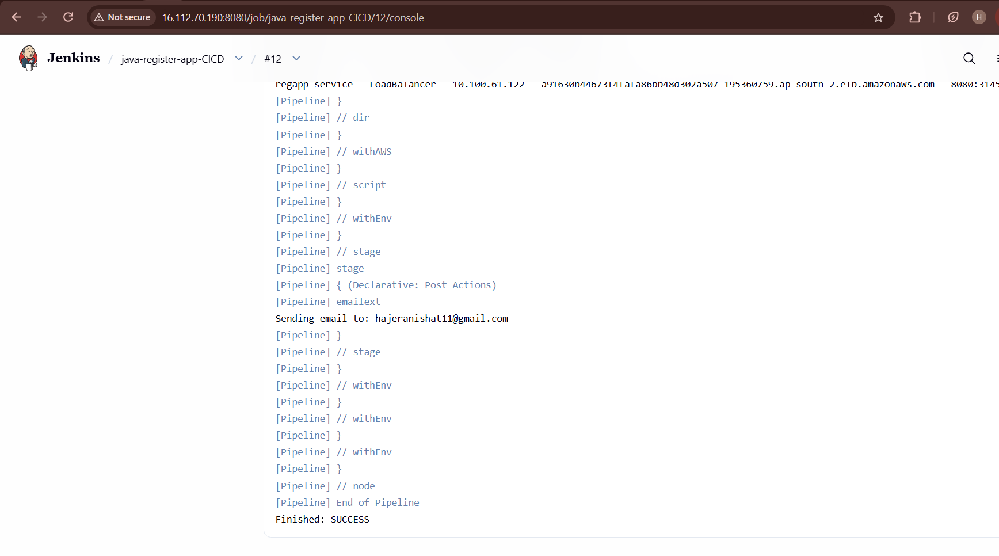
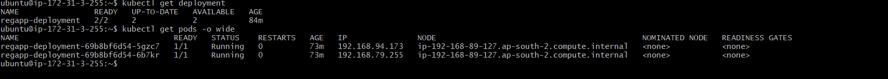
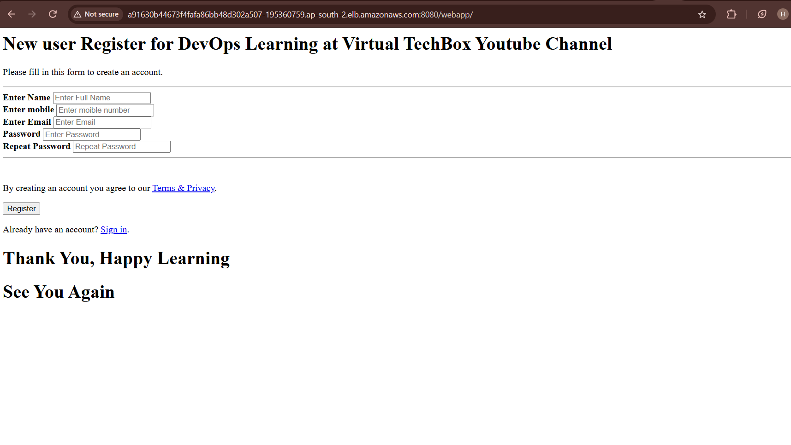

# Automated CI/CD Pipeline for a Java Web Application

This project is an end-to-end DevOps CI/CD project for a Java web application.

The goal was to understand how source code moves from GitHub through the CI/CD pipeline and finally gets deployed to Kubernetes on AWS.

## Tools Used

- GitHub – Source code management
- Jenkins – CI/CD pipeline
- Maven – Build and testing
- SonarQube – Code quality analysis
- JFrog Artifactory – Maven artifact repository
- Docker – Containerization
- Docker Hub – Docker image registry
- Trivy – Container vulnerability scanning
- Terraform – Infrastructure setup
- Amazon EKS – Kubernetes cluster
- Kubernetes – Application deployment
- AWS LoadBalancer – Application access

## CI/CD Flow

```text
GitHub
   ↓
Jenkins
   ↓
Maven Build & Test
   ↓
SonarQube
   ↓
Quality Gate
   ↓
JFrog Artifactory
   ↓
Docker Build
   ↓
Docker Hub
   ↓
Trivy Scan
   ↓
Amazon EKS
   ↓
Kubernetes
   ↓
AWS LoadBalancer
   ↓
Java Web Application


## What the Jenkins Pipeline Does

The Jenkins pipeline automates the following steps:

1. Checks out the application code from GitHub.
2. Builds and tests the application using Maven.
3. Runs SonarQube code analysis.
4. Checks the SonarQube quality gate.
5. Publishes the Maven artifact to JFrog Artifactory.
6. Builds the Docker image.
7. Pushes the Docker image to Docker Hub.
8. Scans the Docker image using Trivy.
9. Connects Jenkins to the Amazon EKS cluster.
10. Deploys the application using Kubernetes.
11. Checks the Kubernetes deployment and running pods.
12. Exposes the application through an AWS LoadBalancer.

## Project Structure
Automated-CICD-App/
│
├── Kubernete/
│   ├── regapp-deploy.yml
│   └── regapp-service.yml
│
├── server/
│   ├── src/
│   └── pom.xml
│
├── webapp/
│   ├── src/
│   └── pom.xml
│
├── Terraform/
│   ├── install.sh
│   ├── main.tf
│   ├── provider.tf
│   └── .terraform.lock.hcl
│
├── Dockerfile
├── Jenkinsfile
├── pom.xml
├── .gitignore
└── README.md

##Kubernetes Deployment

The application is deployed on Amazon EKS using Kubernetes.

The deployment runs two replicas:

regapp-deployment
   ├── Pod 1
   └── Pod 2

The application is exposed using a Kubernetes LoadBalancer service, which creates an AWS LoadBalancer.

## What I Worked On

This project helped me understand how the different parts of a DevOps pipeline work together.

My work progressed through:

**Jenkins setup**
→ **GitHub integration**
→ **Maven build & testing**
→ **SonarQube & Quality Gate**
→ **JFrog Artifactory**
→ **Docker & Docker Hub**
→ **Trivy scanning**
→ **Terraform & AWS infrastructure**
→ **Amazon EKS**
→ **Kubernetes deployment**
→ **AWS LoadBalancer**
→ **Troubleshooting and deployment verification**

## Project Screenshots

### Jenkins Pipeline

The complete CI/CD pipeline was executed successfully through Jenkins.



### Kubernetes Deployment

The application is running with two replicas on Amazon EKS.



### AWS LoadBalancer

The Kubernetes `LoadBalancer` service is exposed through AWS.


### Deployment

The project was successfully deployed and verified on the AWS environment.



## Security

Credentials are managed through Jenkins credentials instead of being stored directly in the Jenkinsfile.

Sensitive files such as Terraform state files, environment files, private keys and tokens are excluded using .gitignore.

## Future Improvements
Add monitoring and logging
Add HTTPS
Add Kubernetes resource limits
Add automated rollback
Use AWS Secrets Manager or Kubernetes Secrets
Add separate development and production environments

## Author

Hajera Nishat

GitHub: https://github.com/hajera-nishat